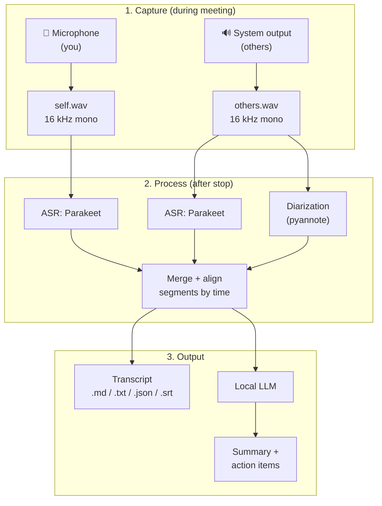

# HearHere

[](https://github.com/julianjocham/hearhere/actions/workflows/tests.yml)
[](LICENSE)
[](https://www.python.org/downloads/)

**A fully local meeting transcriber.** HearHere listens to *both sides* of a meeting on your machine — your microphone (you) and the system audio output (everyone else) — and turns the whole conversation into an accurate, speaker-attributed transcript, with an optional local-LLM summary and action items.

No cloud. No accounts. No audio ever leaves your machine (unless you *explicitly* opt into a remote GPU backend — see [Compute backends](#compute-backends)).

Powered by NVIDIA's [**parakeet-tdt-0.6b-v3**](https://huggingface.co/nvidia/parakeet-tdt-0.6b-v3) multilingual speech-to-text model.

> **Status:** Working. The Windows record → transcribe path has been exercised
> end to end on real audio hardware on two machines. **Linux** recording
> (PipeWire/PulseAudio sink-monitor loopback) is implemented and the capture path
> is verified on real hardware; **macOS** capture is the remaining gap.
> Everything else (processing, diarization, summaries, exports, the web UI, the
> remote worker) is cross-platform.
> [INSTRUCTIONS.md](INSTRUCTIONS.md#troubleshooting) covers the rough edges that
> did turn up, mostly around audio-device selection.

---

## Table of contents

- [Why HearHere](#why-hearhere)
- [Key features](#key-features)
- [How it works](#how-it-works)
- [Compute backends](#compute-backends)
- [Audio capture per platform](#audio-capture-per-platform)
- [Tech stack](#tech-stack)
- [Project structure](#project-structure)
- [Installation](#installation)
- [Configuration](#configuration)
- [Usage](#usage)
- [Output files](#output-files)
- [Pipeline stages](#pipeline-stages)
- [Pluggable engines](#pluggable-engines)
- [Roadmap](#roadmap)
- [Privacy](#privacy)
- [Requirements](#requirements)
- [Known constraints](#known-constraints)
- [Contributing](#contributing)
- [License & attribution](#license--attribution)

---

## Why HearHere

Most meeting transcribers are cloud services: you paste in a bot, your audio is uploaded, and someone else's servers do the work. HearHere is the opposite:

- **Local-first.** Recording, transcription, diarization, and summarization all run on your own machine by default.
- **Captures both channels.** Your voice (mic input) *and* the meeting audio you hear (system output) are recorded, so nothing said by remote participants is lost.
- **Knows who's who.** Your channel is trivially "Me"; the output channel is diarized into distinct speakers ("Speaker 1", "Speaker 2", …) that you can rename.
- **Works without a fancy GPU.** Runs on a plain laptop (CPU), a real NVIDIA GPU machine, or a rented remote GPU — same app, one config switch.
- **Optimized for English & German**, while supporting all 25 languages the model knows.

### Intended usage scenarios

HearHere is designed around three real deployment scenarios (in order of expected first use):

| # | Scenario | Backend | Fully local? |
|---|----------|---------|--------------|
| 1 | **Laptop, no real GPU** (Windows / macOS / Linux) | Local CPU | ✅ Yes |
| 2 | **Rented remote GPU** (e.g. a RunPod machine reachable over API) | Remote HTTP backend | ⚠️ No — audio is sent to your remote box |
| 3 | **Workstation with an NVIDIA GPU** | Local CUDA | ✅ Yes |

Scenario 2 is a **speed fallback** for when a laptop is too slow and no local GPU exists. It is explicitly *not* fully local: HearHere warns on every remote run and asks for confirmation before the first upload.

---

## Key features

- 🎙️ **Dual-channel capture** — records mic (self) and system output (others) as two separate 16 kHz mono streams.
- 📝 **High-accuracy transcription** — Parakeet TDT 0.6B v3, with word- and segment-level timestamps.
- 🗣️ **Speaker diarization** — separates individual speakers on the "others" channel via [pyannote](https://github.com/pyannote/pyannote-audio) (pluggable).
- 🏷️ **Automatic speaker labeling** — your channel is labeled "Me"; other speakers get stable, renameable labels.
- 🌍 **English + German focus**, all 25 supported European languages available; per-meeting language config or auto-detect.
- 🧠 **Local LLM summary** — meeting summary, decisions, and action items via a pluggable local LLM (Ollama by default).
- 💾 **Multiple export formats** — Markdown, plain text, JSON, and SRT/WebVTT subtitles.
- 🔌 **Pluggable engines** — ASR, diarization, and LLM backends are all swappable behind clean interfaces.
- 🔒 **Private by default** — everything on-device unless you choose the remote backend.

---

## How it works

HearHere uses a **record-then-transcribe** model (not live streaming). You start recording at the beginning of a meeting; when you stop, the full pipeline runs and produces the transcript and summary. This is simpler, more robust, and more accurate than real-time streaming — which Parakeet is not designed for.



**Why two channels matter:** by recording your mic and the system output separately, "Me vs. Others" attribution is free (it's just which file the audio came from), and diarization only has to solve the easier problem of separating the *remote* speakers.

---

## Compute backends

The heavy work (ASR, diarization, LLM) runs behind a **compute backend** abstraction. The same pipeline code runs regardless of where the models execute; you pick the backend in config.

| Backend | `device` | Description | Local |
|---------|----------|-------------|-------|
| **Local CPU** | `cpu` | Runs everything on CPU. Slow but universal. Default for GPU-less laptops (Scenario 1). | ✅ |
| **Local CUDA** | `cuda` | Runs on a local NVIDIA GPU. Fast. (Scenario 3). | ✅ |
| **Local MPS** *(experimental)* | `mps` | Apple Silicon GPU via Metal. Support depends on NeMo/PyTorch MPS coverage; may fall back to CPU per-op. | ✅ |
| **Remote API** | `remote` | Sends audio to a remote HearHere worker (e.g. on RunPod) over HTTP and gets results back (Scenario 2). | ⚠️ No |

**Selection logic:** `auto` prefers `cuda` if a compatible NVIDIA GPU is present, else `cpu`. `remote` is never auto-selected — it is always an explicit, warned choice.

The remote backend runs the *same* HearHere pipeline in "worker mode" on the remote machine and exposes a small HTTP API; the local app becomes a thin client that uploads the two WAV files and downloads the transcript/summary artifacts.

---

## Audio capture per platform

Capturing **system output** ("what you hear") is OS-specific and is the only genuinely platform-dependent part of HearHere. Each platform has an adapter behind a common `AudioCapture` interface. Development priority: **Windows → macOS → Linux**.

### Windows (priority 1) — WASAPI loopback
- **Mic:** standard WASAPI/`sounddevice` input.
- **System output:** WASAPI **loopback** capture of the default render device — no virtual cable needed.
- Likely libs: [`soundcard`](https://github.com/bastibe/SoundCard) or `sounddevice` with WASAPI loopback.

### macOS (priority 2) — virtual audio device
- **Mic:** CoreAudio input.
- **System output:** macOS cannot capture output directly; requires a **virtual audio device** the user installs once, e.g. [BlackHole](https://github.com/ExistentialAudio/BlackHole). Route output through a Multi-Output Device (speakers + BlackHole) and capture BlackHole as an input.
- README/installer must document this setup step clearly. (macOS 14.4+ has `CoreAudio` process-tap APIs as a future no-virtual-device path.)

### Linux (priority 3) — PipeWire / PulseAudio monitor ✅ *implemented*
- **Mic:** the default (or configured) PulseAudio/PipeWire source.
- **System output:** the `.monitor` source of the default (or configured) sink — native loopback of exactly what you hear, no virtual cable and no extra software.
- **Backend:** both channels go through [`soundcard`](https://github.com/bastibe/SoundCard), which talks to PulseAudio/PipeWire (`pipewire-pulse`) directly and enumerates each sink's monitor as a loopback source. Unlike Windows there's no need to split the mic onto `sounddevice` — PulseAudio has no WASAPI-style format pitfalls, and `sounddevice` on Linux binds to raw ALSA `hw:` devices, bypassing PipeWire and its defaults.
- **Requirements:** a running PipeWire (or PulseAudio) session and the system `libpulse0` package (`sudo apt install libpulse0`) — `soundcard` talks to PulseAudio directly and does not use PortAudio here; then `pip install "hearhere[capture]"`. Run `hearhere devices` to list source and sink names for `[capture].mic_device` / `output_device`.

> **WSL2 note:** WSL2 has no direct audio device access by default. HearHere on WSL2 would need audio bridged from the Windows host (or run on the Windows side natively). Treat WSL2 as a dev environment, not a target.

All adapters must output the format Parakeet requires: **16 kHz, mono, WAV/PCM** (resampled on capture if the device rate differs).

---

## Tech stack

- **Language:** Python 3.10+ (**3.12 recommended** — see [Requirements](#requirements))
- **ASR:** NVIDIA NeMo (`nemo_toolkit[asr]`) running `nvidia/parakeet-tdt-0.6b-v3`
- **Diarization:** pyannote.audio (pluggable)
- **Local LLM:** Ollama (pluggable; a llama.cpp/GGUF backend is planned)
- **Audio I/O:** `sounddevice` / `soundcard` / `soundfile`, with per-OS adapters
- **CLI:** `typer`
- **Config:** TOML (`pydantic`-validated)
- **Local web UI:** FastAPI backend + a single-page browser frontend for browsing, reviewing, renaming speakers, and re-exporting past meetings (`hearhere ui`)

> **Model requirements (from the model card):** input must be **16 kHz mono WAV/FLAC**; the model provides char/word/segment timestamps; long-form supported (up to ~24 min full-attention on big GPUs, ~3 h with local attention); minimum ~2 GB RAM to load; license **CC-BY-4.0**.

---

## Project structure

```
hearhere/
├── README.md
├── INSTRUCTIONS.md            # step-by-step install & run guide
├── TODO.md                    # roadmap / remaining work
├── LICENSE
├── pyproject.toml
├── config.example.toml
├── .github/workflows/tests.yml
├── hearhere/
│   ├── cli.py                 # record / process / export / speakers / list / devices / worker / ui
│   ├── config.py              # TOML config + pydantic schema, defaults
│   ├── models.py              # Segment / Transcript / Meeting / Summary data models
│   ├── compute.py             # device resolution (auto / cpu / cuda / mps)
│   ├── extras.py              # optional-dependency detection + actionable errors
│   ├── logging_setup.py       # per-meeting hearhere.log
│   ├── capture/
│   │   ├── base.py            # AudioCapture interface + platform dispatch
│   │   └── windows.py         # WASAPI loopback (mic via sounddevice, output via soundcard)
│   ├── engines/
│   │   ├── asr/
│   │   │   ├── base.py        # ASREngine interface + registry
│   │   │   ├── parakeet_nemo.py
│   │   │   └── remote.py      # remote-backend client
│   │   ├── diarization/
│   │   │   ├── base.py        # DiarizationEngine interface + registry
│   │   │   └── pyannote.py
│   │   └── llm/
│   │       ├── base.py        # SummarizerEngine interface + registry
│   │       └── ollama.py
│   ├── pipeline/
│   │   ├── orchestrator.py    # ties the stages together
│   │   ├── merge.py           # time-align + merge self/others segments
│   │   └── artifacts.py       # meeting folder layout on disk
│   ├── export/
│   │   ├── markdown.py
│   │   ├── text.py
│   │   ├── json.py
│   │   ├── subtitles.py       # SRT / WebVTT
│   │   ├── summary.py         # summary.md
│   │   └── timefmt.py         # timestamp formatting
│   ├── llm/
│   │   └── prompts.py         # summary / action-item prompt templates
│   ├── remote/
│   │   ├── protocol.py        # request/response models shared by client & worker
│   │   ├── client.py          # thin local client
│   │   ├── consent.py         # "audio is leaving your machine" gate
│   │   └── worker.py          # FastAPI worker (bearer-token gated)
│   └── webui/
│       ├── server.py          # FastAPI app (binds loopback by default)
│       ├── service.py         # listing / speaker rename / re-export
│       └── static/index.html  # single-page frontend
└── tests/                     # 116 tests; no network, no model downloads
```

---

## Installation

> A short version. [INSTRUCTIONS.md](INSTRUCTIONS.md) is the step-by-step guide,
> including Windows specifics, GPU/CUDA notes, and first-time model setup.

### 1. Prerequisites
- Python 3.10+ — **3.12 is the recommended version**; it's what HearHere is developed and tested against, and some ML dependencies still lag on 3.13
- (Optional) NVIDIA GPU with CUDA for Scenario 3
- (Optional) [Ollama](https://ollama.com) installed and running, for local summaries
- (macOS only) A virtual audio device such as [BlackHole](https://github.com/ExistentialAudio/BlackHole)

### 2. Install HearHere
```bash
git clone https://github.com/julianjocham/hearhere.git
cd hearhere
python -m venv .venv && source .venv/bin/activate   # Windows: .venv\Scripts\activate

# Minimum to record and get a transcript:
pip install -e ".[capture,asr]"

# Or everything — speaker names, summaries, and the browser UI:
pip install -e ".[capture,asr,diarization,llm,webui]"
```

**Pick your extras.** Only `typer`/`pydantic` are hard dependencies — audio
capture, ASR, diarization, and summaries each live behind an extra and are
imported lazily, so a bare `pip install -e .` gives you a CLI that fails at the
first real recording or model load with a "needs the `[…]` extra" message.

| Extra | Pulls in | Needed for |
| --- | --- | --- |
| `capture` | sounddevice, soundcard, numpy, soundfile | `hearhere record` |
| `asr` | NeMo, PyTorch | transcription (Parakeet) |
| `diarization` | pyannote.audio, PyTorch | speaker attribution |
| `llm` | ollama client | `summary.md` |
| `webui` | FastAPI, uvicorn | `hearhere ui` |
| `remote` | FastAPI, uvicorn, httpx | `hearhere worker` / remote backend |

### 3. First-time model setup
- **Parakeet** downloads automatically on first run via NeMo.
- **pyannote** diarization requires a one-time step: accept the model terms on Hugging Face and provide an HF token so the weights can be downloaded. After download it runs fully offline. Set the token in config or via `HF_TOKEN`.
- **Ollama:** pull a model, e.g. `ollama pull llama3.1` (or a German-capable model).

### 4. Remote backend (optional, Scenario 2)
On the remote GPU machine (e.g. RunPod), install HearHere and run the worker:
```bash
hearhere worker --host 0.0.0.0 --port 8808
```
Then point the local client at it in config (`backend = "remote"`, `remote.url = "..."`).

---

## Configuration

Config lives in `config.toml` (searched in the working dir, then `~/.config/hearhere/`). Copy `config.example.toml` to start.

```toml
[general]
language = "auto"          # "auto" | "en" | "de" | any of the 25 supported codes
storage_dir = "~/HearHere" # where meeting artifacts are written

[compute]
backend = "local"          # "local" | "remote"
device  = "auto"           # "auto" | "cpu" | "cuda" | "mps"

[compute.remote]
url   = "https://<your-runpod-host>:8808"
token = ""                  # bearer token for the worker; or set HEARHERE_REMOTE_TOKEN
# WARNING: with backend="remote", audio is uploaded to this host. HearHere warns
# on every remote run and asks for confirmation before the first upload.

[capture]
# Device selection; "default" uses the OS default devices.
mic_device    = "default"
output_device = "default"   # the loopback/monitor/virtual device
sample_rate   = 16000       # resampled to 16k if the device differs

[asr]
engine = "parakeet_nemo"    # pluggable
model  = "nvidia/parakeet-tdt-0.6b-v3"
timestamps = "segment"      # "segment" | "word" | "char"

[diarization]
enabled = true
engine  = "pyannote"        # pluggable
hf_token = ""               # or set HF_TOKEN env var
min_speakers = 0            # 0 = auto
max_speakers = 0            # 0 = auto

[llm]
enabled = false             # OFF by default — transcription only. Set true (and
                            # run Ollama) to also generate a summary.
engine  = "ollama"          # "llamacpp" is accepted but not yet implemented
model   = "llama3.1"
tasks   = ["summary", "action_items", "decisions"]

[export]
formats = ["markdown", "json", "srt"]  # any of: markdown, text, json, srt, vtt
```

---

## Usage

Eight commands. `hearhere --help` lists them all; every command takes
`--config/-c` to point at a specific `config.toml`.

```bash
# Record a meeting — captures mic + system output until you press Enter,
# then runs the full pipeline automatically.
hearhere record --title "Weekly Sync"

# Pin the language (auto-detection can flip mid-clip); "auto" to detect.
hearhere record --title "Weekly Sync" --language de

# Record only; transcribe later.
hearhere record --title "Weekly Sync" --no-process

# Transcribe/process an already-recorded meeting folder:
hearhere process ~/HearHere/2026-09-13_weekly-sync/

# Re-export an already-processed meeting into other formats (never re-runs models):
hearhere export ~/HearHere/2026-09-13_weekly-sync/ --format md,srt,vtt

# Rename speakers after the fact:
hearhere speakers ~/HearHere/2026-09-13_weekly-sync/ --set "Speaker 1=Anna" --set "Speaker 2=Ben"

# List past meetings:
hearhere list

# List capture devices, to pin [capture].mic_device / output_device in config:
hearhere devices

# Browse, review, rename speakers, and re-export in the browser (loopback only):
hearhere ui                       # http://127.0.0.1:8809

# On a remote GPU box — serve the remote backend:
hearhere worker --host 0.0.0.0 --port 8808
```

`record` and `process` also take `--yes/-y` to skip the remote-upload
confirmation prompt when `backend = "remote"`.

Typical flow: `hearhere record` → talk → press Enter → transcript (and summary,
if the LLM is enabled) land in the meeting folder.

---

## Output files

Each meeting is a self-contained folder under `storage_dir`:

```
2026-09-13_weekly-sync/
├── meeting.json          # canonical structured record (segments, speakers, timestamps, metadata)
├── audio/
│   ├── self.wav          # your mic (16 kHz mono)
│   └── others.wav        # system output (16 kHz mono)
├── transcript.md         # human-readable, speaker-attributed
├── transcript.txt        # plain text
├── transcript.srt        # subtitles
├── summary.md            # LLM summary + decisions + action items
└── hearhere.log
```

**Example `transcript.md`:**
```markdown
# Weekly Sync — 2026-09-13

**Duration:** 32m 14s · **Language:** de/en · **Speakers:** Me, Anna, Ben

---

**[00:00:04] Me:** Kurzes Update zum Release …
**[00:00:11] Anna:** The staging build is green, but …
**[00:00:29] Ben:** Ich übernehme das Deployment morgen.
```

The `meeting.json` is the source of truth; all export formats are derived from it, so re-exporting never re-runs the models.

---

## Pipeline stages

1. **Capture** — OS adapter records `self.wav` and `others.wav` at 16 kHz mono.
2. **ASR (self)** — Parakeet transcribes the mic channel → segments labeled `Me`.
3. **ASR (others)** — Parakeet transcribes the output channel → segments (unattributed).
4. **Diarization (others)** — pyannote segments the output channel by speaker turns.
5. **Merge & align** — combine `self` and `others` segments on a shared timeline; attach diarization labels to the `others` ASR segments (overlap-based assignment).
6. **Summary** — local LLM produces summary / decisions / action items from the merged transcript.
7. **Export** — write `meeting.json` and all configured export formats.

Each stage reads/writes the meeting folder, so the pipeline is resumable and individual stages can be re-run.

---

## Pluggable engines

ASR, diarization, and LLM summarization sit behind small interfaces so backends can be swapped via config without touching the pipeline.

```python
# engines/asr/base.py
class ASREngine(Protocol):
    def transcribe(self, wav_path: str, language: str | None) -> list[Segment]:
        """Return time-stamped text segments for a 16 kHz mono WAV."""

# engines/diarization/base.py
class DiarizationEngine(Protocol):
    def diarize(self, wav_path: str, min_speakers: int, max_speakers: int) -> list[SpeakerTurn]:
        """Return speaker-labeled time turns."""

# engines/llm/base.py
class SummarizerEngine(Protocol):
    def summarize(self, transcript: Transcript, tasks: list[str]) -> Summary:
        """Return summary / decisions / action items."""
```

Shipping implementations: `parakeet_nemo` + `remote` (ASR), `pyannote` (diarization), `ollama` (LLM). A `llamacpp` LLM backend is registered in config but not yet implemented. Add your own by implementing the interface and registering it under a config name.

---

## Roadmap

**Done:**

- ✅ **Core (Windows).** WASAPI capture, Parakeet ASR (CPU + CUDA), merge, Markdown/text/JSON/SRT/VTT export, CLI.
- ✅ **Speakers & summaries.** pyannote diarization, speaker renaming, Ollama summaries.
- ✅ **Remote backend.** FastAPI worker + remote client for a rented GPU (Scenario 2), token-gated, with explicit "leaving your machine" consent.
- ✅ **Local web UI.** Browse, review, rename speakers, and re-export past meetings in the browser.

**Remaining:**

- ⬜ **macOS capture.** BlackHole / virtual-device capture + setup docs; MPS device support.
- ✅ **Linux capture.** PipeWire/PulseAudio sink-monitor loopback via `soundcard` (implemented; capture path verified on real hardware).
- ⬜ **llama.cpp/GGUF summarizer** as an Ollama-free LLM backend.

See [TODO.md](TODO.md) for the detailed breakdown.

---

## Privacy

- By default, **100% on-device**: audio, transcripts, and summaries never leave your machine.
- The **only** exception is `backend = "remote"`, which uploads audio to a host *you* configure. HearHere warns on every remote run and requires confirmation before the first upload (`--yes/-y` to skip the prompt).
- Recording other people may be subject to laws and workplace policies requiring consent. **HearHere does not obtain consent for you** — that's your responsibility.

---

## Requirements

- Python 3.10+ — **3.12 recommended.** The test suite runs on 3.10–3.13 in CI, but the heavy ML extras (NeMo, PyTorch) are only verified on 3.12
- ~2 GB RAM minimum to load the ASR model (more recommended)
- CPU works everywhere; NVIDIA GPU (Ampere/Hopper/Blackwell/Volta class) strongly recommended for speed
- (macOS) a virtual audio device (BlackHole) for output capture
- (Optional) Ollama for local summaries; Hugging Face token for pyannote first download

---

## Known constraints

- **Not real-time.** HearHere is record-then-transcribe; there is no live word-by-word transcript.
- **CPU is slow.** On a GPU-less laptop, processing a long meeting can take a while (that's what Scenario 2's remote GPU is for).
- **macOS output capture needs a virtual device** until process-tap support is added.
- **WSL2 has no direct audio** — not a runtime target.
- **pyannote needs a one-time online step** (accept terms + token) to download weights; it runs locally afterward.
- **Diarization is imperfect**, especially with heavy cross-talk on the output channel; speaker labels are editable.

---

## Contributing

Issues and pull requests are welcome. [CONTRIBUTING.md](CONTRIBUTING.md) covers
the dev setup (`pip install -e ".[remote,webui,dev]"` runs the whole test suite
without downloading a single model), the project conventions, and what a good PR
looks like. The biggest open item is **macOS capture** — see
[TODO.md](TODO.md).

---

## License & attribution

- HearHere: **MIT** — see [LICENSE](LICENSE).
- **Model:** `nvidia/parakeet-tdt-0.6b-v3` is licensed **CC-BY-4.0**. Attribute NVIDIA when you distribute transcripts or derivatives as required by that license.
- Diarization via **pyannote.audio** and any LLM you plug in carry their own licenses — check them for your use.

---

*HearHere — hear what was said, right here on your machine.*
